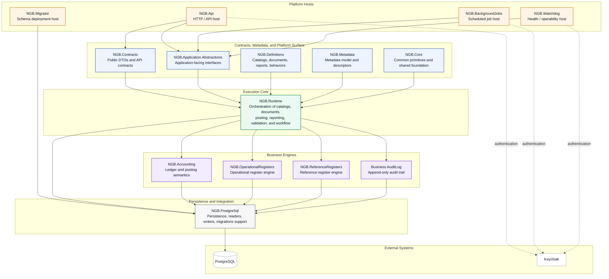
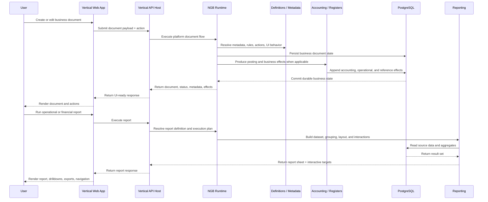

<p align="center">
  <a href="https://ngbplatform.com">
    
  </a>
</p>

<h1 align="center">NGB Platform</h1>

<p align="center">
  <strong>Open-source platform for building accounting-centric business applications and industry solutions.</strong>
</p>

<p align="center">
  Built on <strong>.NET</strong> and <strong>PostgreSQL</strong>, designed for modular business systems, production-grade accounting, metadata-driven UI, and vertical solutions.
</p>

<p align="center">
  <a href="https://ngbplatform.com">Website</a>
  ·
  <a href="https://docs.ngbplatform.com">Docs</a>
  ·
  <a href="https://pm-demo.ngbplatform.com">Property Management (Live Demo)</a>
  ·
  <a href="https://trade-demo.ngbplatform.com">Trade (Live Demo)</a>
  ·
  <a href="https://ab-demo.ngbplatform.com">Agency Billing (Live Demo)</a>
</p>

---

## NGB Platform Intro

[](https://youtu.be/jeZZZaD8OoM)

▶️ [Watch the intro video on YouTube](https://youtu.be/jeZZZaD8OoM)

---

## Table of Contents

- [What is NGB Platform](#what-is-ngb-platform)
- [Why NGB exists](#why-ngb-exists)
- [Who NGB is for](#who-ngb-is-for)
- [What you can build with NGB](#what-you-can-build-with-ngb)
- [Core capabilities](#core-capabilities)
- [Live demos](#live-demos)
- [Architecture overview](#architecture-overview)
- [Architecture flow](#architecture-flow)
- [Monorepo structure](#monorepo-structure)
- [Technology stack](#technology-stack)
- [Getting started](#getting-started)
- [Design principles](#design-principles)
- [Contributing](#contributing)
- [License](#license)

---

## What is NGB Platform

**NGB Platform** is an open-source platform for building **accounting-centric business applications** and **industry-specific solutions**.

NGB provides a production-oriented foundation for systems built around:

- catalogs and business documents;
- posting and accounting effects;
- operational and reference registers;
- metadata-driven forms and lists;
- auditability and explainability;
- reporting and analytical views;
- vertical solutions built on a shared platform core.

NGB is not a low-code toy and not a monolithic ERP bundle. It is a **platform for building serious line-of-business systems** with a clear architecture, strong domain conventions, and a practical path from framework to real vertical applications.

---

## Why NGB exists

Business software is usually forced into one of two extremes:

- **generic web frameworks**, which are flexible but leave the hardest business architecture problems unsolved;
- **large ERP products**, which are powerful but heavy, inflexible, and difficult to adapt cleanly.

NGB exists to offer a third path:

- a **modular platform** instead of one-off project scaffolding;
- a **business-application architecture** instead of generic MVC plumbing;
- an **accounting-aware domain foundation** instead of bolted-on finance logic;
- a **shared platform core + vertical solutions** model instead of duplicating infrastructure across products.

The goal is simple: help developers and product teams build production-grade business systems faster, with fewer architectural compromises and a stronger long-term foundation.

---

## Who NGB is for

NGB is designed for:

- **software engineers and architects** building serious business applications;
- **product teams** creating vertical SaaS or internal business platforms;
- **consultancies and implementation teams** building industry-specific solutions;
- **founders** who need a reusable platform for multiple business products;
- **teams that want source code ownership** instead of vendor lock-in.

NGB is especially relevant when your solution includes one or more of the following:

- business documents with lifecycle and posting;
- accounting logic or financial statements;
- operational balances or register-style state tracking;
- metadata-driven UI and dynamic forms;
- auditable history and explainable system behavior;
- multiple industry solutions sharing one platform base.

---

## What you can build with NGB

NGB is designed for building serious business software.

It is well suited for applications where business documents, workflows, accounting, reporting, auditability, and domain-specific rules are core architectural concerns rather than secondary features.

With NGB, teams can build:

- vertical business applications;
- finance and operations platforms;
- accounting-centric SaaS products;
- internal enterprise systems;
- industry-specific ERP-style solutions;
- workflow-heavy back-office applications;
- custom business platforms with strong domain modeling;
- long-lived systems that require explainability, consistency, and extensibility.

The demo solutions included in this repository show a few possible applications of the platform, but they do not limit the range of systems that can be built with NGB.

---

## Core capabilities

### Platform foundation

- Modular architecture built for shared platform capabilities and vertical extensions.
- Clear separation between core domain, runtime, infrastructure, application hosts, and industry solutions.

### Business application model

- Metadata-driven catalogs and documents.
- Universal patterns for lists, forms, payloads, actions, and UI metadata.
- Consistent lifecycle model for business objects and business documents.

### Accounting and register engine

- Production-oriented accounting foundation.
- Operational registers and reference registers as first-class platform concepts.
- Append-only business history and effect-oriented modeling.
- Support for posting flows, balances, turnovers, and financial reporting.

### Reporting and analysis

- Platform reporting contracts and execution model.
- Interactive reporting surface for business and accounting scenarios.
- Report definitions, filters, grouping, exports, and vertical reports.

### Operations and platform services

- PostgreSQL as the system of record.
- Background jobs infrastructure.
- Database migration tooling.
- Watchdog / health surface.
- Structured observability hooks.
- SSO integration through Keycloak.

### Frontend and UX foundation

- Shared UI framework.
- Metadata-driven web applications for vertical solutions.
- Custom branding and authentication theme support.

---

## Live demos

### 🔑 Demo access

The demo applications include a preconfigured administrator account for evaluation purposes.

**Default demo user**
- **Name:** Alex Carter
- **Role:** Admin
- **Email:** alex.carter@demo.ngbplatform.com
- **Password:** `DemoAdmin!2026`

This account is intended for demo and evaluation use only.

### Explore NGB through live demo solutions

- **Property Management** — https://pm-demo.ngbplatform.com
- **Trade** — https://trade-demo.ngbplatform.com
- **Agency Billing** — https://ab-demo.ngbplatform.com

The repository currently contains the platform core and source code for the demo solutions in this monorepo. Live demos are intended to show how one platform can support multiple business domains with a shared architectural base.

---

## Architecture overview

NGB follows a **layered platform architecture** built around reusable platform hosts, shared contracts and metadata, a central execution core, specialized business engines, and PostgreSQL-based persistence.

At the top level, NGB provides dedicated platform hosts for API delivery, background processing, health and operability, and schema deployment. These hosts do not implement business behavior themselves. Instead, they compose and expose the platform through shared contracts, abstractions, and runtime orchestration.

At the center of the platform is **NGB.Runtime**. It acts as the execution core that coordinates catalogs, documents, posting, reporting, validation, and workflow behavior. Rather than scattering business logic across hosts, NGB concentrates orchestration in the runtime layer and delegates specialized responsibilities to dedicated platform engines.

Those engines include **NGB.Accounting**, **NGB.OperationalRegisters**, **NGB.ReferenceRegisters**, and the business audit log. Together they provide the core business mechanics of the platform: ledger semantics, register-based state handling, reference-state projection, and append-only auditability.

Persistence and database interaction are handled through **NGB.PostgreSql**, which serves as the platform’s infrastructure bridge for readers, writers, and migration support. Platform data is stored in **PostgreSQL**, while authentication is integrated with **Keycloak**.

### High-level architecture



### Architectural layers

1. **Platform Hosts**  
   Entry-point hosts for HTTP APIs, background jobs, health monitoring, and schema deployment.

2. **Contracts, Metadata, and Platform Surface**  
   Shared DTOs, application abstractions, metadata, definitions, and common primitives that define how the platform is described and consumed.

3. **Execution Core**  
   The central orchestration layer implemented by **NGB.Runtime**.

4. **Business Engines**  
   Specialized engines for accounting, operational registers, reference registers, and append-only audit logging.

5. **Persistence and Integration**  
   PostgreSQL-based infrastructure through **NGB.PostgreSql**, plus integration with external systems such as PostgreSQL and Keycloak.

---

## Architecture flow

The following diagram shows the typical business flow through NGB.



---

## Monorepo structure

This repository is organized as a **single monorepo**.

```text
NGB.sln
│
├─ Platform core
│  ├─ NGB.Core
│  ├─ NGB.Metadata
│  ├─ NGB.Definitions
│  ├─ NGB.Contracts
│  ├─ NGB.Application.Abstractions
│  ├─ NGB.Runtime
│  ├─ NGB.Accounting
│  ├─ NGB.OperationalRegisters
│  ├─ NGB.ReferenceRegisters
│  ├─ NGB.Api
│  ├─ NGB.BackgroundJobs
│  ├─ NGB.Watchdog
│  ├─ NGB.PostgreSql
│  ├─ NGB.Persistence
│  ├─ NGB.Tools
│  └─ NGB.Migrator.Core
│
├─ Vertical solutions
│  ├─ NGB.AgencyBilling.*
│  ├─ NGB.PropertyManagement.*
│  └─ NGB.Trade.*
│
├─ UI workspace
│  ├─ ui/ngb-ui-framework
│  ├─ ui/ngb-agency-billing-web
│  ├─ ui/ngb-property-management-web
│  ├─ ui/ngb-trade-web
│  └─ ui/ngb-auth-theme
│
├─ Docker environments
│  ├─ docker-compose.ab.yml
│  ├─ docker-compose.pm.yml
│  └─ docker-compose.trade.yml
│
└─ Tests
   ├─ Platform unit and integration tests
   └─ Vertical unit and integration tests
```

---

## Technology stack

NGB is built with a practical, production-oriented stack:

- **Backend:** .NET 10
- **Database:** PostgreSQL
- **Schema versioning:** Evolve
- **Authentication / SSO:** Keycloak
- **Background jobs:** Hangfire-based job infrastructure
- **Logging / observability:** Serilog + Seq-friendly structured logging setup
- **Frontend:** Vue 3 + Vite + Tailwind CSS + shared UI workspace
- **Containerized local environments:** Docker Compose

---

## Getting started

### 🔑 Demo access

The demo applications include a preconfigured administrator account for evaluation purposes.

**Default demo user**
- **Name:** Alex Carter
- **Role:** Admin
- **Email:** alex.carter@demo.ngbplatform.com
- **Password:** `DemoAdmin!2026`

This account is intended for demo and evaluation use only.

### Prerequisites

You should have the following installed:

- .NET SDK
- Docker and Docker Compose
- Node.js
- PostgreSQL client tools if you want to inspect databases manually

### Clone the repository

```bash
git clone https://github.com/ngbplatform/NGB.git
cd NGB
```
### 🔒 HTTPS certificates

The Docker Compose setup mounts ASP.NET certificates from `${HOME}/.aspnet/https`. On a new machine, generate development certificates first if needed:

```bash
dotnet dev-certs https --trust
```

### ⚠️ Windows note

Before starting the application in Docker on Windows, ensure that the `$HOME` environment variable is set in the current PowerShell session.

Check the current value:

```powershell
echo "$HOME"
```

If it is not set correctly, define it manually:

```powershell
[System.Environment]::SetEnvironmentVariable('HOME', $env:USERPROFILE.Replace('\', '/'), 'User')
```

### Run the Property Management demo locally

```bash
docker compose -f docker-compose.pm.yml --env-file .env.pm up --build
```

### Run the Trade demo locally

```bash
docker compose -f docker-compose.trade.yml --env-file .env.trade up --build
```

### Run the Agency Billing demo locally

```bash
docker compose -f docker-compose.ab.yml --env-file .env.ab up --build
```

### Build the .NET solution

```bash
dotnet build NGB.sln
```

### Run backend tests

```bash
dotnet test NGB.sln
```

### Run frontend workspace tests

```bash
cd ui
npm install
npm run test:all
```

> Exact local environment details may evolve over time. The live demos are the fastest way to see the platform in action.

---

## Design principles

NGB is built around a few strong principles:

### 1. Platform first

Shared cross-cutting capabilities belong in the platform, not duplicated across solutions.

### 2. Vertical-ready architecture

Industry solutions should extend the platform cleanly without turning the platform into vertical-specific code.

### 3. Accounting-aware business design

Accounting, registers, balances, and reporting are not afterthoughts. They are core platform concerns.

### 4. Metadata-driven UI and behavior

The platform should describe forms, lists, actions, and interactions as reusable metadata wherever that makes sense.

### 5. Durable system of record

PostgreSQL is the authoritative source of business truth.

### 6. Auditability and explainability

Business systems should make it possible to understand what happened, why it happened, and what effects were produced.

### 7. Production-minded engineering

The goal is not a demo-first framework. The goal is a reusable foundation for real business software.

---

## Why Apache 2.0

NGB Platform is released under the **Apache License 2.0**.

This license was chosen to make the platform easy to adopt, easy to evaluate, and practical for real engineering teams. It allows commercial use, modification, and redistribution while preserving license and copyright notices.

See the [LICENSE](LICENSE) file for details.

---

## Contributing

Contributions, discussions, issues, and pull requests are welcome.

If you want to explore NGB, the best starting points are:

- the live demos;
- the platform core projects in the solution;
- the vertical solutions in `NGB.PropertyManagement.*`, `NGB.Trade.*` and `NGB.AgencyBilling.*`;
- the shared UI workspace under `ui/`.

Suggested contribution areas:

- documentation and developer onboarding;
- platform features and infrastructure improvements;
- UI/UX improvements;
- new demo scenarios and example solutions;
- test coverage and reliability improvements.

---

## License

Licensed under the **Apache License 2.0**.

See:

- [LICENSE](LICENSE)
- https://www.apache.org/licenses/LICENSE-2.0

---

## Links

- **Website:** https://ngbplatform.com
- **Docs:** https://docs.ngbplatform.com
- **Property Management (Live Demo):** https://pm-demo.ngbplatform.com
- **Trade (Live Demo):** https://trade-demo.ngbplatform.com
- **Agency Billing (Live Demo):** https://ab-demo.ngbplatform.com

If you are evaluating NGB, start with the live demos, then explore the monorepo structure and the platform architecture described above.
